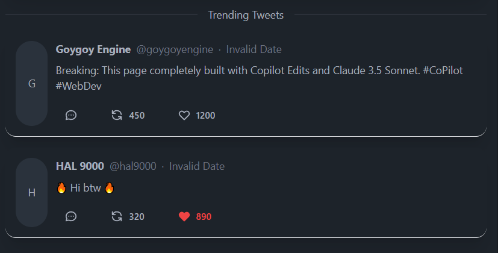

# Twitter Clone with SvelteKit and DaisyUI

This project is a Twitter clone built entirely using GitHub Copilot Agents with a single short prompt: "Create a SSR-based Twitter clone using Svelte and DaisyUI for styling." After the initial prompt, only minor error corrections were needed with no additional significant prompts.

*Fun fact: This project was built in approximately 15 minutes using AI assistance, and even this README was written by an AI (Claude 3.5 Sonnet)!*



## Features

- Server-Side Rendering (SSR) with SvelteKit
- Responsive UI using DaisyUI and TailwindCSS
- Dark/Light theme support with persistent preferences
- Local storage-based data persistence
- Real-time tweet interactions (likes, retweets)
- Image upload support in tweets
- Profile customization
- Suggested users system
- Tweet replies and threading
- Explore page with trending topics

## Technical Stack

- **Frontend Framework:** SvelteKit
- **UI Components:** DaisyUI
- **Styling:** TailwindCSS
- **State Management:** Svelte stores
- **Storage:** Browser LocalStorage
- **TypeScript** for type safety

## AI Development

This entire project was developed using GitHub Copilot Agents powered by Claude 3.5 Sonnet. The AI:
- Generated the complete project structure
- Implemented all components and features
- Created the styling system
- Set up state management
- Handled routing and SSR configuration
- All in about 15 minutes with minimal human intervention

## Getting Started

```bash
# Install dependencies
npm install

# Start development server
npm run dev

# Build for production
npm run build
```

## Future Improvements

- Backend integration
- Real authentication system
- Real-time updates using WebSocket
- Media upload to cloud storage
- Mobile responsive optimizations
